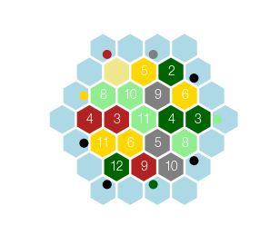

# Catan scenario randomizer

A Python package to produce randomised *Settlers of Catan* scenarios.

## Example use

The `scenarios` folder contains example scenario files, encoded in YAML.

### Text output

```python
import catan

scenario = catan.import_yaml('scenarios/catan34.yaml')
board = catan.randomize(scenario)

print(board)
```

```
      .↘H ... .↙M ...
    ... DES F05 W02 .↙3
  .→F P08 P10 M09 F06 ...
... H04 H03 P11 W04 W03 .←P
  .→3 F11 F06 M05 P08 ...
    ... W12 H09 M10 .↖3
      .↗3 ... .↖W ...
```

### Graphical output

```
catan.show_board(board)
```

